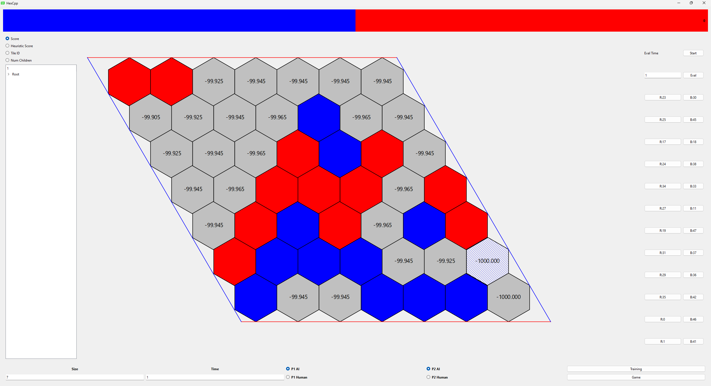

<h1>Hex</h1>

<h2>Game Overview</h2>

In Hex, the board is made of hexagons arranged in a parellelogram.  Each player is assigned 2 of the sides which are opposite to each other, and placing tiles 1 at a time attempt to make a connection of tiles connecting the two sides.  Due to the nature of the game, there is no possibility of a draw.

The size of the board varies from 7x7 to 19x19, although there is no practical limit to this size.  An 11x11 board has a larger state space than chess by a factor of 10^10, and it was only until the mid-late 2010s that computers beat humans on the larger board sizes.

[Wikipedia](https://en.wikipedia.org/wiki/Hex_(board_game))
<h2>Algorithm Overview</h2>

The AI agent evalulates the board using a minmax search tree algorithm.  At each step, the agent will choose the path with the highest or lowest score, depending on whether the move represents red (max) or blue (min).  If the selected node in the tree is not a leaf node, it will search its children to see which child the other player should select.  If it is a leaf node, it will evaluate all of the moves that could possibly be made in that state, calculate which move gives the best heuristic score, and the propogate the best score up the chain to represent the additional information in this branch.

To discourage the algorithm from searching too far down one branch (which is often suboptimal as the agent only needs to make the best current move, so only exploring one path doesn't help evaluate the other immediate move options), a penalty is applied the further down in depth it goes.  This penalty means that a search score is kept for each node, and that this score is different for each player.  A player will expand along the best search score, but when the move is selected it will use the best score, not the best search score.

<h2>Heuristic Overview</h2>

To execute the minmax algorith, a heuristic function needs to be created to evaluate a board without looking further down the game state.  The heuristic used in this application has the following components, the results of which are summed to get the heuristic score

<ol>
<li>Closeness to center

Each tile is given a score based on how close it is to the center.  The score is calculated by summing the scores of the tiles each player has placed and taking the difference

</li>
<li>Longest Chain

For each player, the longest chain of connected tiles is calculated.  The length of the chain is considered in rank, not in number of tiles.  The rank of a tile is the minimum number of tiles needed to connect to either the top for red, or the left for blue.

</li>
<li>Longest Template Chain

When playing Hex optimally, a player does not build their chain tile by tile, but rather placing tiles ahead and connecting the middle later.  There are a number of scenarios that can occur where a player has not currently made a connection, but given optimal play by both sides there is no action that one player can make from preventing another player from making a connection.  This score is calculated from the length of the longest chain considering these connections.

The types of connections that are considered are the following.

<ol>
<li>Template

Two chains have a template between them if there are two or more open tiles that are adjent to a tile in both chains.  If the opposing player plays on one of the tiles, the two chains can be connected by responding with the other tile.

</li>
<li>Edge

An edge is when a chain shares 2 or more open tiles that are connected to one of the players edges.  Similar to a template, the player can respond to a move on one of these tiles by connecting the other.

</li>
<li>Higher-Order Edge

A Higher order edge is similar to a regular edge in that a connection to a certain edge cannot be broken, but these edges are made from a rank that is more than 1 away from the edge.  For these, it is not immediately clear that a connection cannot be blocked, but solving them shows no solution blocks connection.  These solutions typically require a large number of tiles to be empty or occupied by the same color, so it typically is found in the early game.

</li>
</ol>
</li>
<li>Current Player bias offset

Given the nature of the game, no move that a player makes can actively harm the position, so there is an oscillating effect where a red move always increases the score, and a blue move always decreases the score.  This can cause mean the score for a position can depend on which player was last evaluated on the best path(s), so this is fixed by subtracting a fixed amount from the score if the last move made was from red.

</li>
</ol>

For points 2 and 3, a significant problem that would develop is that an agent would often get stuck--a chain may have been made connecting ranks 0 through 3, but tiles the opponent placed has made it so that there is no immediate path to made a chain or template connecting the current chain to rank 4, so no moves would improve that players position and the agent would wanderingly place tiles, unless it was directly defending against the opponent.

The fix for this was to develop an algorithm in which certain tiles can be <b>poisoned</b> for a player (independently for red and blue) and direction (positive or negative), and a poisoned tile cannot contribute to the rank in a chain or template--if a chain contained tiles in ranks 0-3, and all of the tiles in rank 3 were poisoned in the positive direction, it would only be a chain of length 2, not of length 3.

A tile is considered poisoned in a direction if the two tiles (or one tile for certain tiles along the edge of the board) are either occupied by the opponent, or poisoned in the same direction.  These tiles may still be used to form a winning chain, but that winning chain is required to make certain moves that do not advance the rank of the chain.  This method can result in overpunishing a chain by removing more ranks than is needed to advance the chain (ie removing 2 ranks when only 1 additional move is needed to advance), but this resulted in much better performance overall, and due to the complexity in making a better check the increase in heuristic performance by doing this may not lead to improvement over a simpler but faster heuristic.

<h2>Current State</h2>

Due to the significant complexity of the game, as well as needing to determine what the system is doing (determining whether unexpected behavior is due to a bug, a poor heuristic, insufficient search time, or the agent seeing something that the human player did not), a significant amount of work was done to see what the agent was thinking when it made a move.  During a game, the system saves the entire move history, and is able to move back to any point in the game to evaluate the position.  The user is also able to look through the evaluation tree to see the score, heuristic score, and the number of boards evaluated for each possible move to evaluate the behavior of the agent.

